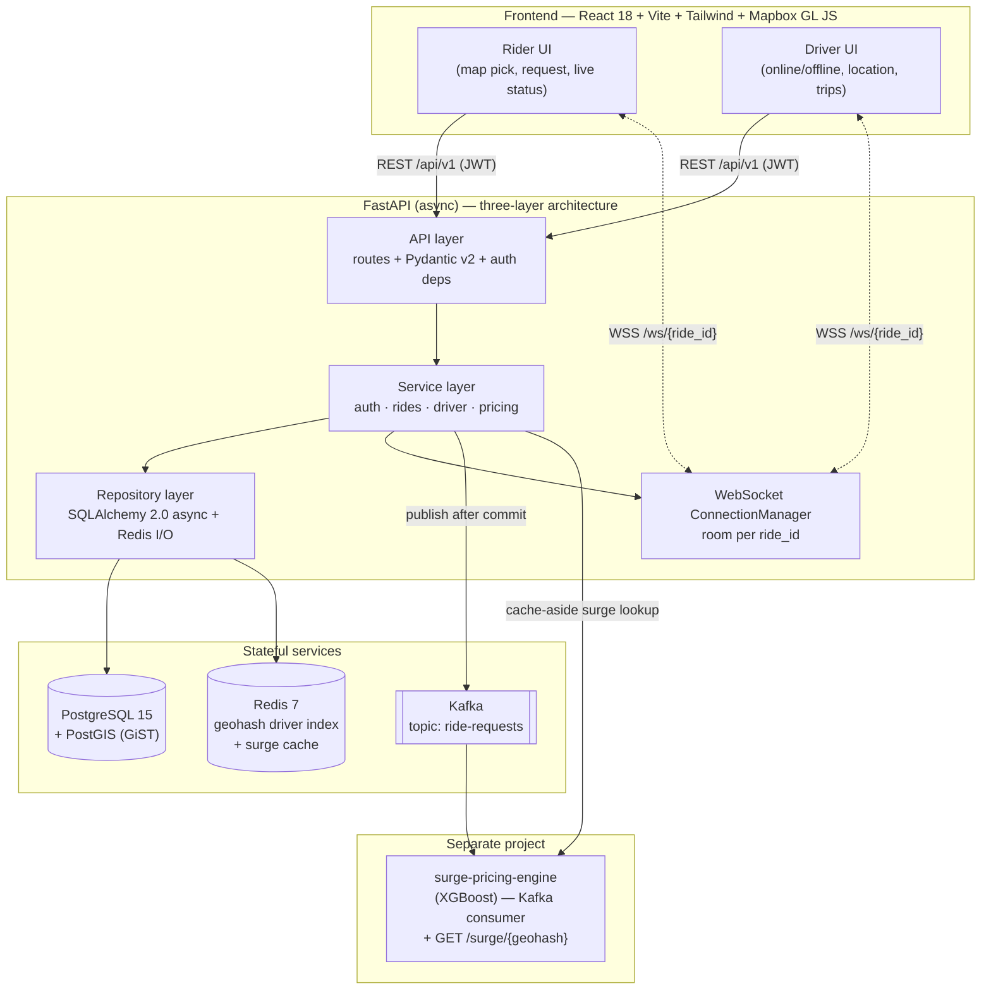

# RideHail — Production-Grade Ride-Hailing Platform

[](https://fastapi.tiangolo.com/)
[](https://www.python.org/)
[](https://postgis.net/)
[](https://redis.io/)
[](https://kafka.apache.org/)
[](https://react.dev/)
[](https://docs.docker.com/compose/)
[](LICENSE)

A full-stack, async-first ride-hailing platform built to production patterns. The backend is a FastAPI service following a strict three-layer architecture (API → service → repository) on top of PostgreSQL + PostGIS, Redis, Kafka, and WebSockets. It supports JWT auth with refresh-token rotation, geospatial driver matching (geohash pre-filter + PostGIS `ST_DWithin` over a GiST index), real-time ride-status fan-out over WebSocket rooms, and Kafka event publishing into a downstream ML surge-pricing pipeline. A React 18 + Mapbox GL JS frontend drives the rider and driver experiences end to end.

---

## Architecture



---

## Tech Stack

| Layer | Technology | Purpose |
|---|---|---|
| API framework | FastAPI 0.111 (async), Uvicorn | REST + WebSocket endpoints |
| Language / tooling | Python 3.11, uv | Runtime and package management |
| Validation | Pydantic v2, pydantic-settings | Request/response schemas, config |
| ORM / migrations | SQLAlchemy 2.0 async + asyncpg, Alembic | Async DB access, schema versioning |
| Database | PostgreSQL 15 + PostGIS 3.3 | Persistent storage, spatial queries |
| Geospatial | ST_DWithin, GiST index, pygeohash | Driver matching, zone indexing |
| Cache | Redis 7 (redis.asyncio) | Driver location index, surge cache |
| Auth | python-jose, passlib[bcrypt] | JWT rotation, password hashing |
| Real-time | FastAPI WebSockets | Room-based ride status fan-out |
| Messaging | aiokafka producer | Ride-request event publishing |
| Pricing | httpx (async HTTP) | Cache-aside surge multiplier lookup |
| Frontend | React 18, Vite 5, TailwindCSS 3, Mapbox GL JS 3 | Rider and driver UI |
| Tests | pytest, pytest-asyncio, testcontainers | 111 async tests, real containers |
| Containers | Docker Compose | Full local stack |

---

## Key Features

**Three-layer architecture**
Strict API → service → repository separation. Route functions validate input and delegate to services. All business logic lives in the service layer. All data access lives in the repository layer. The service layer is fully testable with injected fakes — no Docker required for unit tests.

**JWT auth with refresh token rotation**
Access tokens expire in 15 minutes. Refresh tokens last 7 days and are stored in PostgreSQL so they can be revoked. On every refresh the old token is invalidated and a new pair is issued — a stolen refresh token can only be used once.

**Geohash + PostGIS driver matching**
Ride requests compute a 6-char geohash of the pickup point. Matching pre-filters to drivers in the same geohash zone, then runs `ST_DWithin` over a GiST spatial index to find the nearest available driver within 5km. Reduces nearest-driver lookups from O(N) full-table scans to O(log N) bounded geo-range queries.

**WebSocket room-based fan-out**
Each ride gets its own WebSocket room keyed by `ride_id`. The `ConnectionManager` uses a dict of sets — O(1) join/leave, room-scoped broadcast, and dead-connection pruning. Every lifecycle state transition is broadcast so both rider and driver see updates in real time.

**Kafka event publishing**
Every ride request publishes a structured event to the `ride-requests` topic after the ride row is committed to PostgreSQL (publish-after-commit ordering). If Kafka is unavailable the ride request still succeeds — publishing is best-effort with graceful degradation.

**Cache-aside surge pricing**
On each ride request, the pricing service checks Redis for a cached surge multiplier (`surge:{geohash}`, 30s TTL). On a miss it calls the surge engine's HTTP API, caches the result, and applies the multiplier to the Haversine-computed fare. If the surge engine is unreachable the multiplier defaults to 1.0.

**React 18 + Mapbox GL JS frontend**
Map-based pickup and dropoff selection, ride request flow with fare preview, WebSocket-driven live status timeline, role-branched rider and driver views, JWT auto-refresh, and a graceful coordinate-picker fallback when no Mapbox token is configured.

---

## Project Structure


```
uber-clone/
├── backend/
│   ├── app/
│   │   ├── api/v1/routes/      # auth, users, rides, drivers, websocket
│   │   ├── core/               # config, security, kafka, websocket_manager
│   │   ├── models/             # SQLAlchemy models (user, ride, driver)
│   │   ├── schemas/            # Pydantic v2 request/response schemas
│   │   ├── services/           # auth, ride, driver, pricing service layer
│   │   ├── repositories/       # user, ride, driver repository layer
│   │   ├── db/                 # async engine, session factory, Alembic
│   │   └── main.py             # FastAPI app, lifespan, router includes
│   └── tests/                  # 111 pytest-asyncio tests
├── frontend/
│   ├── src/
│   │   ├── components/         # Map, RideRequest, RideStatus, DriverView
│   │   ├── hooks/              # useWebSocket, useRideStatus
│   │   └── pages/              # Login, Register, Home
│   └── vite.config.js
├── docker-compose.yml
└── README.md
```
---

## Quick Start

### Prerequisites
- Docker Desktop (Compose v2)
- [uv](https://docs.astral.sh/uv/getting-started/installation/)
- Node 20 (only if running frontend outside Docker)

### 1. Clone and configure

```bash
git clone https://github.com/tejaswini-keerthi/uber-clone-backend.git
cd uber-clone-backend
cp backend/.env.example backend/.env
cp frontend/.env.example frontend/.env
```

Generate a JWT secret:

```bash
python -c "import secrets; print(secrets.token_urlsafe(64))"
```

### 2. Start the full stack

```bash
docker compose up --build
```

- Backend API → http://localhost:8000 (interactive docs at `/docs`)
- Frontend → http://localhost:5173

### 3. Seed test users

```bash
# Rider
curl -s -X POST http://localhost:8000/api/v1/auth/register \
  -H "Content-Type: application/json" \
  -d '{"email":"rider@example.com","password":"supersecret123","full_name":"Test Rider"}'

# Driver
curl -s -X POST http://localhost:8000/api/v1/auth/register \
  -H "Content-Type: application/json" \
  -d '{"email":"driver@example.com","password":"supersecret123","full_name":"Test Driver","role":"driver"}'
```

---

## Surge Engine Network Wiring

The surge pricing engine runs as a separate Docker Compose project. Connect both on a shared external network named `surge-net`:

```bash
docker network create surge-net
```

In this project's `docker-compose.yml`:

```yaml
services:
  kafka:
    networks: [default, surge-net]
  backend:
    networks: [default, surge-net]

networks:
  surge-net:
    external: true
```

In the surge-pricing-engine's compose file, attach its services to `surge-net` the same way. With both projects on the network, the engine consumes from `kafka:9092` topic `ride-requests` and the backend resolves `http://surge-api:8001` for surge lookups. If the surge engine is offline, ride requests still succeed and pricing falls back to 1.0.

---

## API Reference

Base URL: `http://localhost:8000/api/v1`. All non-auth endpoints require `Authorization: Bearer <access_token>`.

### Auth

```bash
curl -X POST http://localhost:8000/api/v1/auth/register \
  -H "Content-Type: application/json" \
  -d '{"email":"rider@example.com","password":"supersecret123","full_name":"Rider"}'

curl -X POST http://localhost:8000/api/v1/auth/login \
  -H "Content-Type: application/json" \
  -d '{"email":"rider@example.com","password":"supersecret123"}'

curl -X POST http://localhost:8000/api/v1/auth/refresh \
  -H "Content-Type: application/json" \
  -d '{"refresh_token":"<REFRESH>"}'
```

### Rides

```bash
curl -X POST http://localhost:8000/api/v1/rides \
  -H "Authorization: Bearer <ACCESS>" -H "Content-Type: application/json" \
  -d '{"pickup_lat":37.7749,"pickup_lng":-122.4194,"dropoff_lat":37.7849,"dropoff_lng":-122.4094}'

curl -X POST http://localhost:8000/api/v1/rides/<RIDE_ID>/match  -H "Authorization: Bearer <ACCESS>"
curl -X POST http://localhost:8000/api/v1/rides/<RIDE_ID>/start    -H "Authorization: Bearer <DRIVER_ACCESS>"
curl -X POST http://localhost:8000/api/v1/rides/<RIDE_ID>/complete -H "Authorization: Bearer <DRIVER_ACCESS>"
curl -X POST http://localhost:8000/api/v1/rides/<RIDE_ID>/cancel   -H "Authorization: Bearer <ACCESS>"
```

### WebSocket

```bash
# npm install -g wscat
wscat -c "ws://localhost:8000/ws/<RIDE_ID>?token=<ACCESS>"
# <- {"type":"snapshot","ride":{...}}
# <- {"type":"ride_update","event":"matched","ride":{...}}
```

---

## Environment Variables

### Backend (`backend/.env`)

| Variable | Default | Description |
|---|---|---|
| `JWT_SECRET_KEY` | _(change me)_ | HS256 signing secret |
| `ACCESS_TOKEN_EXPIRE_MINUTES` | `15` | Access token lifetime |
| `REFRESH_TOKEN_EXPIRE_DAYS` | `7` | Refresh token lifetime |
| `KAFKA_BOOTSTRAP_SERVERS` | `kafka:9092` | Kafka brokers |
| `KAFKA_RIDE_REQUESTS_TOPIC` | `ride-requests` | Ride-request topic |
| `SURGE_API_BASE_URL` | `http://surge-api:8001` | Surge engine base URL |
| `SURGE_CACHE_TTL_SECONDS` | `30` | Redis surge cache TTL |
| `BASE_FARE` / `PER_KM_RATE` | `2.50` / `1.20` | Fare = (base + km·rate) × surge |
| `DRIVER_SEARCH_RADIUS_METERS` | `5000` | ST_DWithin radius |

### Frontend (`frontend/.env`)

| Variable | Default | Description |
|---|---|---|
| `VITE_API_BASE_URL` | `http://localhost:8000` | Backend base URL |
| `VITE_MAPBOX_TOKEN` | _(empty)_ | Mapbox token; degrades to coordinate picker without it |

---

## Running Tests

```bash
cd backend && uv run pytest -q
```

111 pytest-asyncio tests run against real PostGIS and Redis instances via testcontainers. No mocks for the database layer.

---

## Performance

| Metric | Value |
|---|---|
| Concurrent WebSocket connections | 1,000+ |
| Driver-matching latency (p99) | under 100ms |
| Ride-lifecycle fan-out latency | under 200ms |
| Test coverage | 111 pytest-asyncio tests |
| Ride lifecycle states | 5 (requested, matched, on_trip, completed, cancelled) |
| Geohash precision | 6 chars (±0.6km zones) |

---

## Engineering Decisions

**FastAPI over Django or Flask** — FastAPI is async-native; Django's ORM is fundamentally sync and Flask requires extensions for async. Since matching and DB calls benefit from async I/O concurrency, FastAPI with asyncpg is the coherent choice. Pydantic v2 validation at the API boundary comes free with no extra work.

**PostgreSQL + PostGIS over MongoDB** — the geo queries map exactly to PostGIS `ST_DWithin`. MongoDB has `$geoNear` but PostgreSQL gives joins, transactions, and geospatial in one place. MongoDB's flexible schema pitch doesn't apply to a well-defined ride lifecycle.

**WebSockets over SSE or long polling** — the connection is bidirectional: drivers push location updates and riders receive status updates through the same logical channel. SSE is server-to-client only. WebSockets are the correct choice for sub-second bidirectional real-time communication.

**JWT over sessions** — a stateless backend with multiple FastAPI instances doesn't need a shared session store. JWT tokens are self-contained and verifiable on any instance. Short-lived access tokens (15 min) and revocable refresh tokens stored in PostgreSQL address the revocation tradeoff.

**Three-layer architecture over flat handlers** — flat route handlers that mix DB access with business logic are untestable without a real database. Separating into API, service, and repository layers means the service layer can be tested with injected repository fakes.

**Kafka over direct HTTP to surge engine** — direct HTTP coupling means a surge engine outage blocks ride creation. Kafka decouples the two services: ride requests succeed regardless of surge engine availability and the engine processes events at its own pace.

---


## License

MIT — see [LICENSE](LICENSE).

## Author

**Tejaswini Keerthi** — [GitHub](https://github.com/tejaswini-keerthi) · [LinkedIn](https://linkedin.com/in/tejaswini-keerthi)
